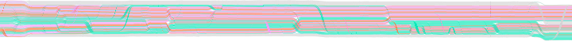
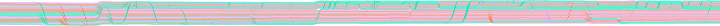
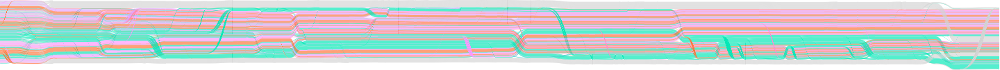
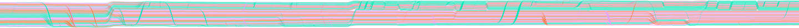

# The navigator's thumbnail, looked at on the documents that matter

**2026-08-14.** Written while bringing the navigator back on the WebGL surface (#36).
The ticket asked for one thing before anything else was built: render the thumbnail at
the real aspect ratio on `5520+` and look at it, because the widget had only ever been
exercised against the 600 bp fixture.

## What the aspect ratio actually is

The thumbnail's height is not a design choice. It follows from the map, which is a strip:

| Document | Content, world units | Aspect | At 360 wide | At 720 wide |
|---|---|---|---|---|
| fixture, 600 bp | 35,562 × 6,325 | 5.6 : 1 | 360 × 64 | 720 × 128 |
| `5520+` | 108,983 × 7,785 | 14 : 1 | 360 × 26 | 720 × 51 |
| `5514+` | 177,994 × 6,360 | 28 : 1 | **360 × 13** | 720 × 26 |

`NAVIGATOR_WIDTH = 360` was chosen against the first row and never seen against the
others. 464 strands in 26 pixels was the number the ticket named; `5514+` is worse, and
13 px is the number nobody had looked at at all.

## What it looks like

Rendered from the scene through the render target, thumbnail canvas only, no rect over it.

`5520+` at 360 × 26 — 

`5514+` at 360 × 13 — 

`5520+` at 720 × 51 — 

`5514+` at 720 × 26 — 

## The finding

**26 px survives; 13 px does not.** At 26 px the strip still shows where the ribbons
swap and where it narrows — coarse landmarks, which is all a navigator is for. At 13 px
the same picture is a hairline: the structure is technically present and there is
nothing in it a person can aim at, and the widget itself is thin enough to be missed as
an object on the page.

The failure is not really resolution, it is the rect. At 200× the viewport rect is
`width / 200` across — 1.8 px at 360 wide, 3.6 px at 720 — inside a box 13 to 26 px
tall. A 1.8 × 13 px marker is a speck. The navigator's entire job is to say *where you
are*, and it does that with the rect, so the rect has to be findable at the zoom where
being lost is possible. That is the zoom the whole widget should be sized for.

**`THUMBNAIL_WIDTH` is 720.** It gives 51 px on `5520+` and 26 px on `5514+` — the
picture legible on both, and a rect that is 3.6 px by 26–51 px at the ceiling, which
reads as a marker rather than as dirt on the screen. 900 was also rendered and is
better again by a hair; 720 is where the gain flattens and it is already half of a
1400 px window, which is a lot of chrome to spend on a widget that is not the map.

The width is a maximum, not a fixed size: the widget takes `min(720, host − inset)`, so a
narrow host gets a smaller navigator instead of one running off the edge it exists to
describe. That clamp is not a feature anybody asked for — it is what raising 360 to 720
costs, since 720 is wider than a PGB panel might be. The bitmap is always baked at the
full 720, whatever width the widget is showing, and scaled by CSS from there: a resize
then costs no re-render at all, a host that widens later gets a sharp thumbnail rather
than a stretched one, and a map that happens to load while the host is collapsed does not
end up permanently a one-pixel picture.

**There is no margin left at 26 px.** `5514+` at 720 is exactly the density this note
calls the floor, and it is the widest document in the set — a strip appreciably longer
than 28:1 would land under it. The answer then is not a wider widget, which is already
half the window: it is to stop deriving the height from the aspect and letterbox a
taller thumbnail against a fixed floor, or to break the strip across two rows. Neither is
worth building against a document nobody has seen.

## Why the thumbnail comes from the render target

Not for performance — it is one render, once per document. It is so that the navigator
cannot disagree with the surface. The alternative on the WebGL surface would have been
to serialize the document a second time and let the browser rasterize it, which is two
pictures out of two pipelines with nothing keeping them the same. Same scene, same
shader, same instance buffer, a different camera: the thumbnail is the map fitted to a
720 px window and nothing more special than that.

One detail carries the picture. At thumbnail zoom a device pixel is ~300 world units and
a band is 15, so a band that landed between sample rows would simply vanish. The
surface's own `uPad` grows every band to cover a pixel and the fragment shader gives it
an alpha of its true thickness over that pixel's height, so bands accumulate into the
pixel they belong to. Without it the thumbnail would be a picture of whichever strands
happened to fall on a sample row — plausible-looking, and not the map.
